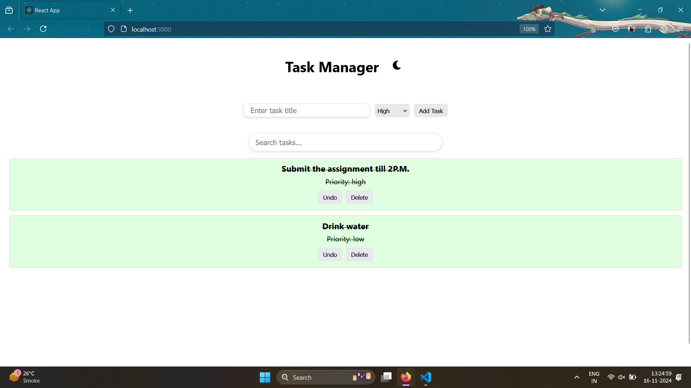
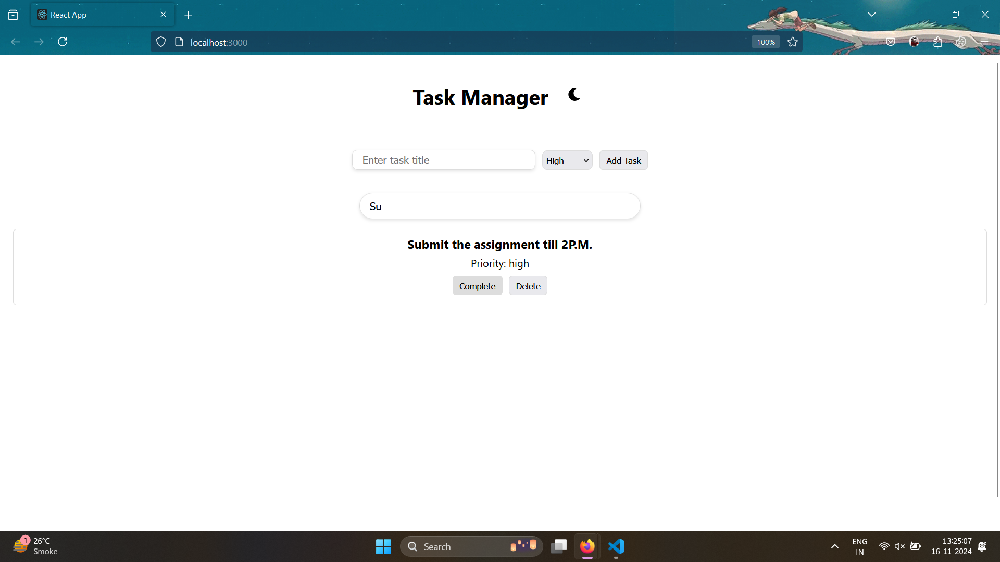
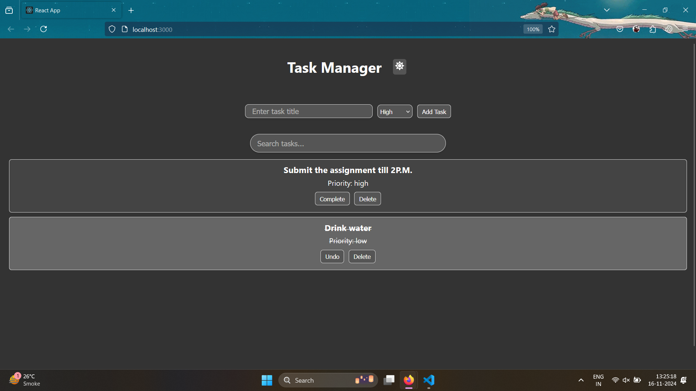

# Task Manager

A simple and efficient task management application built using React. The app allows users to add, delete, search, and manage tasks with features like task completion, priority setting, and a theme toggle between light and dark modes.

## Features

### Basic Features:
1. **Task Input**: 
   - Add tasks with a title and assign a priority (high, medium, low).
   - Tasks are sorted based on priority when added (high priority first).
   
2. **Task Deletion**: 
   - Delete tasks from the list.

3. **Task Persistence**: 
   - Tasks are saved to and loaded from the local storage to persist even after a page reload.

### Stretch Goals:
1. **Task Search**: 
   - Search for tasks by title using the search bar.
   
2. **Task Completion**: 
   - Mark tasks as completed. Completed tasks are visually marked with a strikethrough and different background color.
   
3. **Priority Setting**: 
   - Assign priority levels (high, medium, low) when creating a task.
   
4. **Task Sorting**: 
   - Tasks are automatically sorted by priority (high, medium, low).

5. **UI Animation**: 
   - Smooth animations for task addition, deletion, and completion.

6. **Theme Toggle**: 
   - Toggle between light and dark themes using a button in the header. The theme applies to the entire application.

## Installation

1. **Clone the repository:**
   ```bash
   git clone https://github.com/your-username/task-manager.git

2. **Navigate to the project folder:**
   ```bash
   cd task-manager

3. **Install dependencies:**
   ```bash
    npm install

4. **Run the app:**
   ```bash
   npm start

This will start the development server and open the app in your default web browser.

### Usage

1.  **Add a Task:**
    -  Enter a task title and select its priority, then click "Add Task" to add it to the task list.

2.  **Search for Tasks:**
    -  Use the search bar to filter tasks by title.

3.  **Mark Task as Completed:**
    -  Click on the task to toggle its completion status (marked with a strikethrough).

4.  **Delete Tasks:**
    -  Click the delete button next to a task to remove it from the list.

5.  **Toggle Theme:**
    -  Click the sun/moon icon in the header to switch between light and dark themes.

### Project Structure
    /task-manager
    /src
    /components
        TaskInput.js      # Component to input tasks
        TaskList.js       # Component to display tasks
        TaskItem.js       # Component to create task
    App.js              # Main component containing the logic for the app
    App.css             # Styles for the app (Light/Dark theme, task items)
    package.json          # Project dependencies and scripts
    README.md             # This file

## Assumptions
    1.  The application assumes that local storage is available in the browser for saving tasks.
    2.  The user is familiar with basic web interactions like adding, deleting, and searching for tasks.
    
## Screenshots


*Example of the task list with tasks added.*


*Example of the task manager searching for a task.*


*Example of the app in dark theme.*
    
    
## Technologies Used
    1. React: The core library used for building the user interface.
    2. JavaScript: Programming language used for handling the logic.
    3. CSS: Styling for the light/dark themes, input fields, and buttons.
    4. React Icons: For the theme toggle icons (sun/moon).